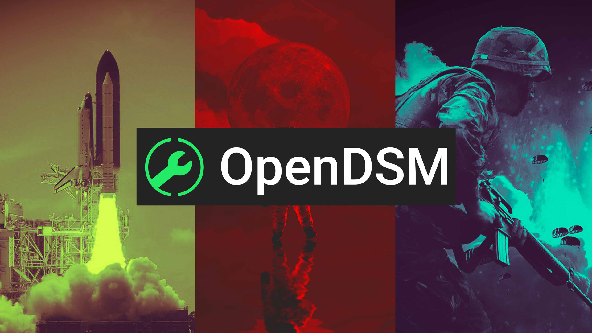
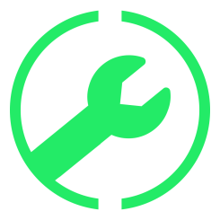

#  
Are you a software developer looking to put your products on the web, but are lacking a platform? We've got you covered! Welcome to the worlds first Opensource Digital Marketplace or OpenDSM for short.'

# Features
OpenDSM allows anyone to create an account and upload their software for free.

## Launcher
Our OpenDSM Launcher is completely cross-platform, available for Windows, Mac, and Linux including their ARM-based versions.  The launcher ensures that your program is installed correctly and safely.  It also allows for better security with our built-in DRM.

## Payments and Fees
Easily setup payments and subscription using our built in system, we only take 5% of all transactions.  If you wish to make your software free, thats fine to, we have a small amount of advertisements on the page to help pay for the software.

## API's and Libraries
Integrate your apps with OpenDSM using , , or using the .  If you need to use our databases to verify if a user owns your software, you can easily do so with our API.
